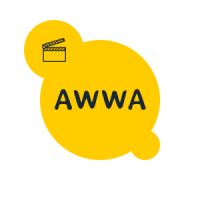

<h1 align="center">awwa</h1>

Web application made for a [university](http://www.poliba.it/ "PoliBA") exam.
The application is accessible [here](http://awwa.sytes.net "facefilm site").

This web app is a social network for videos and tv series :movie_camera:. It is based on the database equipped by [tmdb](https://www.themoviedb.org/)

